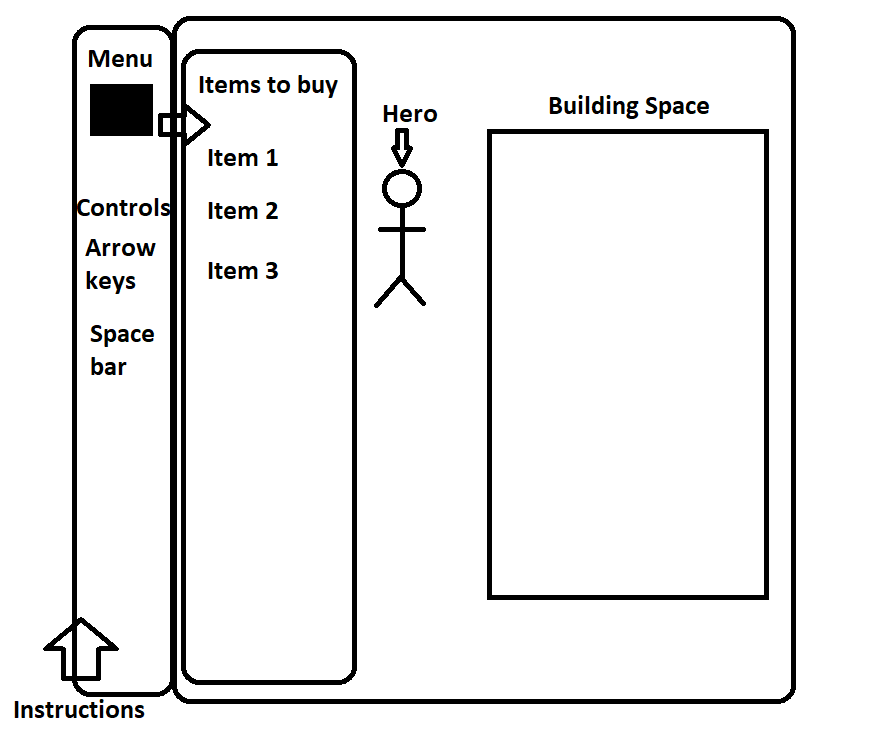
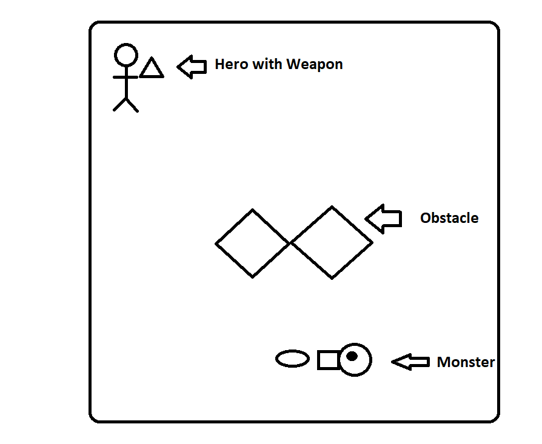

# Wild World
=======================================================================

Wild World is a building tower defense game. The game involves building cannons to shoot enemies as they come. Money can then be used to buy upgrades for the cannons or towers. After certain number of troops from the side gets through, the game is lost.

### Functionality & MVP
=======================================================================

User will be able to
* Open a menu to build cannons.
* User can drag and drop items on to the page to build.
* User can upgrade cannons with enough money.
* Different levels for users to increase difficulty.

### Wireframes
=======================================================================

The game will start out with a hero. He will start with a default style of almost nothing in his building. Stuff can be dragged and dropped onto the page to build stuff.

### Architecture and Technologies
=======================================================================

JavaScript will be mainly used for the logic and algorithms. The main part of it will also be Canvas.

### Timeline
=======================================================================

*Day 1*

Setup all necessary files for canvas and images relevant to the project. Learn how to user Canvas to be able to draw images and load images onto the Canvas.

*Days 2*

Finish drawing the images on Canvas and make the menus on the left. Make logic for troops that go across the screen.

*Day 3*

Make a drag and drop menu. Users should be able to drag and drop items on the page and make it how they want. Cannons can be upgraded to look different.

*Day 4*

Finish implementing the logic.

### Future Considerations
=======================================================================

There can be a second part to the game can involve more complex weaponry types with different troops, making the game more customizable and more difficult.

